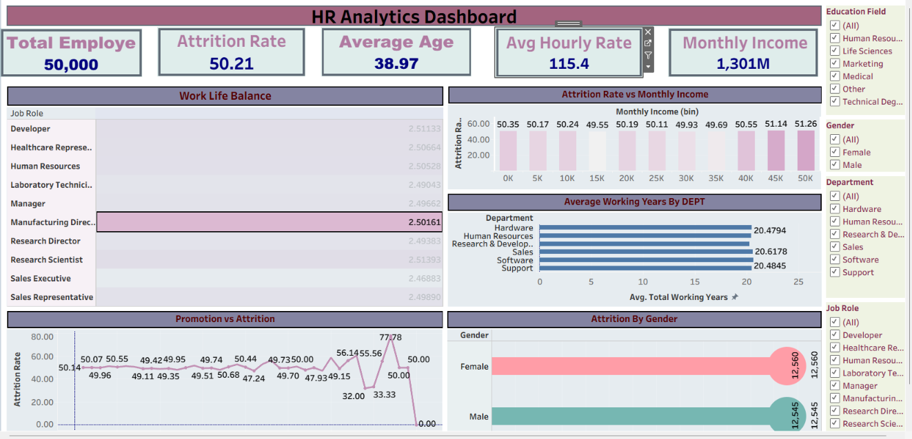

# HR Analytics – Tableau

## 📊 Project Overview

This project analyzes employee data using **Tableau** to identify workforce trends and generate business insights related to employee attrition, income, work-life balance, departments, gender, and promotion history.

An interactive Tableau dashboard was developed to present key HR metrics and allow users to explore employee patterns using filters and visualizations.

## 🛠️ Tools & Technologies

- Tableau
- Data Visualization
- Data Analysis
- Dashboard Design

## 📌 Key Performance Indicators (KPIs)

| KPI | Result |
|---|---:|
| Total Employees | 50,000 |
| Attrition Rate | 50.21% |
| Average Age | 38.97 |
| Average Hourly Rate | 115.4 |
| Total Monthly Income | 1,301M |

## 📈 Dashboard Analysis

The dashboard includes the following analyses:

1. Work-Life Balance by Job Role
2. Attrition Rate vs Monthly Income
3. Average Working Years by Department
4. Promotion vs Attrition
5. Attrition by Gender
6. Employee analysis using Education Field, Gender, Department, and Job Role filters

## 🔍 Key Insights

- Analyzed **50,000 employee records** through an interactive Tableau dashboard.
- Identified an overall employee **attrition rate of 50.21%**.
- The workforce had an **average age of 38.97 years**.
- The overall **average hourly rate was 115.4**.
- Work-life balance remained relatively consistent across job roles, ranging approximately from **2.47 to 2.51**.
- Average working experience across departments was approximately **20 years**.
- Analyzed employee attrition patterns across different monthly income levels.
- Compared promotion history with employee attrition using years since last promotion.
- Compared employee attrition patterns across gender groups.
- Added interactive filters for **Education Field, Gender, Department, and Job Role** to support deeper workforce analysis.

## 🖥️ Dashboard Preview

## 📁 Project Files

- [Tableau Packaged Workbook](./HR_Analytics_Tableau.twbx) – Complete Tableau packaged workbook containing the dashboard and visualizations.
- [Dashboard Preview](./Dashboard.png) – Screenshot of the completed HR Analytics Tableau dashboard.

## 🎯 Key Skills Demonstrated

- Tableau Dashboard Development
- Data Visualization
- Data Analysis
- HR Analytics
- Employee Attrition Analysis
- KPI Development
- Interactive Dashboard Design
- Interactive Filtering
- Business Insight Generation
- Data Storytelling

## 👤 Author

**Sanjay Balan**
